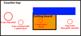

# Digital Kitchen Assistant

Projector with camera/speaker/mic to assist with cooking. Main feature is projecting display onto counter top (may need to be laser projector)

Instead of asking my wife to read me the next instruction while my hands are dirty have a computer guide me through the cooking and selecting of a recipe with either projector or audio instructions.

---

Idea Diagram

Red/Green/Blue text are example projected instructions

--> arrow would be used to mark current task

Would help go through the phases of cooking (option to use projections or/and video/audio )

| Phase                         | Description                                                                                                                                                  |
| ----------------------------- | ------------------------------------------------------------------------------------------------------------------------------------------------------------ |
| 1. **Select Recipe:**         | pick a recipe to cook, could also give suggestions based on available ingredients.                                                                           |
| 2. **prepare workspace:**     | clearing work space and gathering necessary equipment (green outline showing knife/spoon to gather - camera to detect item gathered, red showing prep bowls) |
| 3. **gathering ingredients:** | voice chat for solving missing ingredients with suggested substitutes. Would visually detect items being positioned in designated spaces.                    |
| 4. **preping:**               | guided order of chopping, provide unit conversion and also instruct preheating.                                                                              |
| 5. **cooking**                | instructing when to add ingredients. Automatically starting timers and countdowns on detected phase changes.                                                 |
